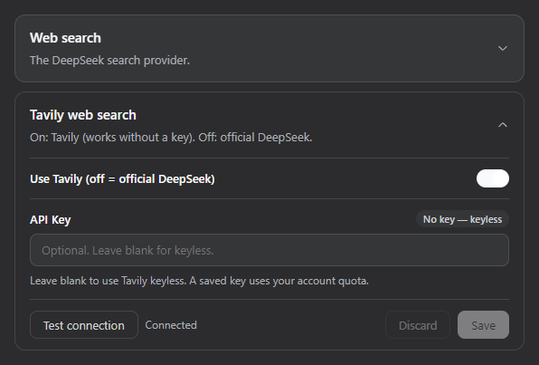

# dsh-tavily

[中文](README.md) | English

[awesome · DSH plugin](https://awesome-dsh-plugin.com)

Tavily web search for [DeepSeek Harness](https://github.com/deepseek-ai/deepseek-harness). Adds Tavily Search API as a web search provider for DSH.

## Install

npm (stable, official recommendation):

```sh
dsh plugin --profile web add dsh-tavily
dsh web
```

Or follow GitHub (latest commit on the repo):

```sh
dsh plugin --profile web add github:SZMY-haruhi/dsh-tavily
dsh web
```

Settings → Plugins → Plugin settings → **Tavily web search**: turn the toggle on. The key is optional; leave it blank for keyless. **Test connection** at the bottom-left checks that search works now (including keyless).

<p align="center">
  
</p>

Pin a commit:

```sh
dsh plugin --profile web add github:SZMY-haruhi/dsh-tavily#<commit>
```

Remove:

```sh
dsh plugin --profile web remove dsh-tavily
```

> `dsh.bundle` · prebuilt `lib/` · git install does not need `allowBuilds`


## Features

- Settings toggle: off = official DeepSeek, on = Tavily — no uninstall to switch back
- No key uses Tavily keyless; a key uses `Authorization: Bearer`
- Bottom-left connection test: one real Tavily search (`max_results: 1`); keyless if no key, account quota if a key is saved (1 credit)
- Timeout, abort, official host lock, drop results without a url
- Key and toggle live on the credentials plane, not the settings file


## Behavior


| Toggle        | Key   | `web_search`         |
| ------------- | ----- | -------------------- |
| Off (default) | —     | official DeepSeek    |
| On            | empty | Tavily keyless       |
| On            | set   | Tavily account quota |


Provider id: `tavily`.

## Credentials


| Ref                     | Meaning                                             |
| ----------------------- | --------------------------------------------------- |
| `TAVILY_API_KEY`        | Optional. Present = account quota; absent = keyless |
| `TAVILY_SEARCH_ENABLED` | Present = on; unset = off                           |


You can also put these in `$DSH_HOME/.credentials.yaml`. Do not commit real keys.

## Updates

- **2026-08-17** Settings card: Test connection at the bottom-left. Works without a key (Tavily keyless). A saved key uses the account path and 1 credit. Does not change the toggle or Save.

---


## Author

**Thanks for the star ❤️**
**[tonkatsu258](https://tonkatsu258.vercel.app/index.html)** · [personal site](https://tonkatsu258.vercel.app/index.html)
