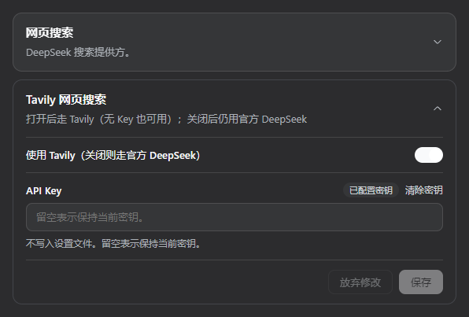

# dsh-web-search-tavily

中文 | [English](README.en.md)

[](https://awesome-dsh-plugin.com) [](https://dshfind.com/zh/plugins/SZMY-haruhi/dsh-web-search-Tavily?ref=badge)

[DeepSeek Harness](https://github.com/deepseek-ai/deepseek-harness) 的 Tavily 网页搜索。设置页开关：开 = Tavily，关 = 官方 DeepSeek。无 Key 也可搜（Tavily keyless）；填了 Key 走账号档。

## 安装

```sh
dsh plugin --profile web add github:SZMY-haruhi/dsh-web-search-Tavily
dsh web
```

设置 → 插件 → 插件配置 → **Tavily 网页搜索**：打开开关即可。Key 可选，不填走无 Key。

<p align="center">
  
</p>

钉 commit：

```sh
dsh plugin --profile web add github:SZMY-haruhi/dsh-web-search-Tavily#<commit>
```

卸载：

```sh
dsh plugin --profile web remove dsh-web-search-tavily
```

> `dsh.bundle` · 预构建 `lib/` · git 安装无需 `allowBuilds`

## 特点

- 设置卡开关：关 = 官方 DeepSeek，开 = Tavily，不用卸包
- 无 Key 走 Tavily keyless；有 Key 走 `Authorization: Bearer`
- 超时、中止、官方 Host 锁定、丢掉无 url 的结果
- Key / 开关写在 credentials，不写设置文件

## 行为

| 开关 | Key | `web_search` |
|---|---|---|
| 关（默认） | — | 官方 DeepSeek |
| 开 | 未填 | Tavily keyless |
| 开 | 已填 | Tavily 账号档 |

Provider id：`tavily`。

## 凭证

| 引用 | 含义 |
|---|---|
| `TAVILY_API_KEY` | 可选。有则走账号档；无则 keyless |
| `TAVILY_SEARCH_ENABLED` | 有此项则为开；删除即关 |

可写在 `$DSH_HOME/.credentials.yaml`。不要把真实钥匙提交进仓库。

---

## Author

<a href="https://tonkatsu258.vercel.app/index.html">
  
</a>

**感谢star❤️**
**[tonkatsu258](https://tonkatsu258.vercel.app/index.html)** · [个人网站](https://tonkatsu258.vercel.app/index.html)
